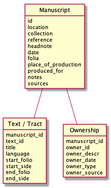
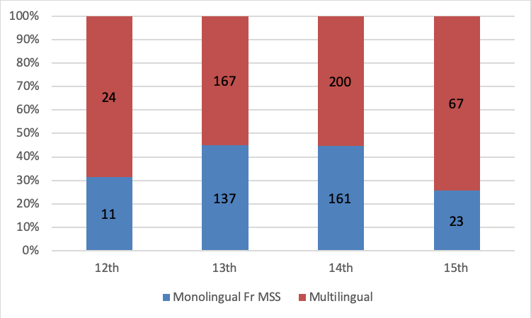
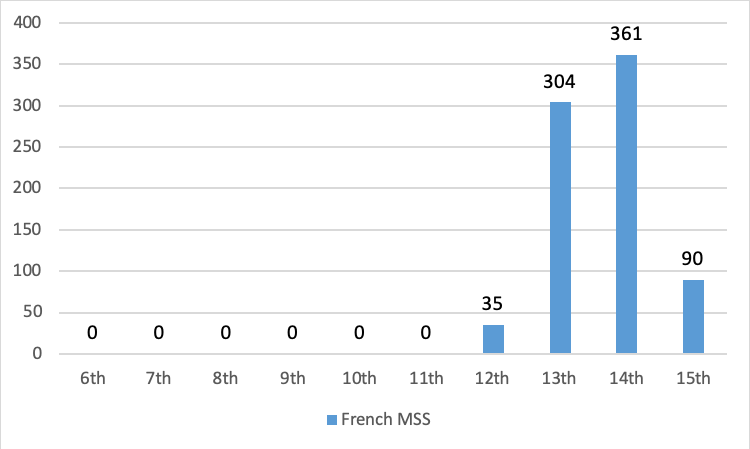
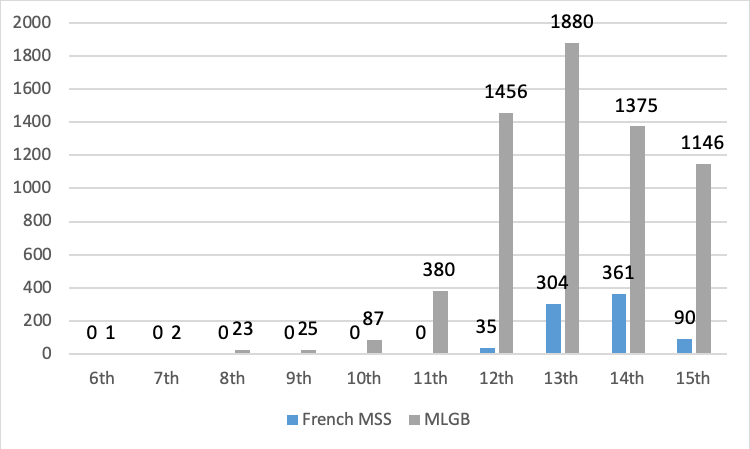

# Introduction

In the traditional linguistic model of medieval England, the Norman
Conquest of 1066 caused English, which had previously been an acceptable
language for literary and cultural production, to be displaced by French
and sidelined in aristocratic and courtly domains. In this traditional
model, English only regained its status within these 'high domains'
after about two hundred and fifty years. A growing body of research has
pointed to the significant structural problems with this traditional
linguistic model, and it is now generally accepted that French persisted
as an important domestic and aristocratic language in England for much
of the late medieval period.[^1] In light of this increasingly important
body of research, the status of French in this period, including the
contexts and implications of its use, is being re-examined.[^2]

To date, studies of the status of French in medieval England have been
focused on isolated examples---either of individual cases of
sociolinguistic interest, or of the interplay of languages within single
manuscripts or texts.[^3] This example-based approach has allowed the
field to productively challenge the traditional 'grand narrative' of
England's linguistic situation, but since examples are, by nature,
highly specific, they provide only limited insight into patterns of
language use across social groups, gender, and temporal periods.

The goal of investigating these language patterns on a broader scale lay
behind this project: the creation of a digital database of manuscripts
containing French literature that were copied in medieval England.[^4]
Manuscripts---hand-written collections of texts---were chosen as the
focus of this quantitative project because they provide unmatched
insight into language use for a period in which no audio or spoken
evidence is available. Since manuscripts are, by definition, handmade
objects, they are distinct witnesses to the social contexts, patrons,
and copyists that produced them.

Manuscripts functioned for their medieval users much like a binder does
for modern ones: as a compilation of material to be consulted later. A
medieval individual or group would select which text or texts should go
in the manuscript and then either copy them out by hand or assign this
task to one or more scribes. Texts in a manuscript, much like those in a
binder, could be removed or added after the manuscript was originally
compiled, either by the original compiler or by a later user.
Manuscripts therefore represent the deliberate and conscious choices of
one or more medieval users, and each manuscript, and each of its unique
stages of compilation, can therefore serve as an information-dense data
point about medieval language use. Taken together, these data points can
be plotted to identify language patterns.

Manuscripts are a particularly good source of evidence for tracking
language use in this context since they survive in far larger quantities
than any other medieval textual witnesses. In particular, manuscripts
can provide insight into the languages that were considered suitable for
literary and documentary culture, and about who owned texts in certain
languages and in which contexts. But there are also limitations to the
kinds of sociolinguistic insight that manuscript data can provide.
First, manuscripts, as written artifacts, cannot be taken as
representatives of spoken language use in any straightforward way, so
the evidence they provide, while valuable for understanding England's
written culture, must be approached with caution when exploring broader
sociolinguistic questions. And the division between written culture and
everyday life in the medieval period could be significant; producing a
medieval manuscript was an expensive and time-consuming process, which
means that manuscripts were usually owned by people with social status,
such as those within the Church or those with financial means.
Manuscripts and their ownership patterns, then, typically provide
information about the literary tastes of an elite subsection of medieval
society. Nevertheless, the texts in manuscripts did reach a more diverse
audience beyond their original owners, and in the absence of audio recordings or
other, more populist forms of language data, manuscripts are an
unmatched source of information about medieval language use.

The approach taken here has been made possible through two important developments: digital tools that enrich and assist quantitative analysis and the increased availability of digitised manuscripts and their catalogues.
Medieval manuscripts have traditionally been studied almost exclusively through qualitative methods---either in isolation or through smaller-scale comparative approaches.
These methods, which remain central to manuscript studies, can yield valuable information about medieval reading communities, book production and textual exchange.
Over the past few decades, though, scholars have increasingly used digital technology to look for large-scale patterns in medieval manuscript datasets.
Among the promising developments in this area are studies aimed at exploring the circulation and production of manuscripts in the medieval world.
So, for example, Michael Sargent has explored a dataset of medieval 'bestsellers' and identified a correspondence between the number of surviving manuscript copies of a given text and its circulation numbers.[^45]

Quantitative approaches---not all of them digital---have also yielded exciting results in the field of medieval paleography--that is, the study of handwriting in medieval manuscripts.
The new horizons in this area are suggested by the project undertaken by a team of researchers headed by Carla Bozzolo and Ezio Ornato, which analysed a large dataset of Psalm manuscripts to gain statistical information about abbreviation practices in the medieval world.[^46]
Quantitative approaches have also offered new insights into changes in how manuscripts were copied; these include Erik Kwakkel's analysis of approximately 350 manuscripts, which revealed several key changes in letter forms that took place in the twelfth century---changes that can now be used to support the dating of other manuscripts.[^47]
Although new quantitative approaches often face significant barriers---some of which are discussed below---the developments in this domain of the past few decades point to the value of such approaches for illuminating patterns that would otherwise have gone unnoticed.

In order to identify language use patterns in this quantitative way,
this project gathered information about the contents and contexts of
manuscripts that would be useful for understanding how French literature
circulated in medieval England. For this reason, information was
gathered about the number of pages (sides of a manuscript folio)
dedicated to French in a given manuscript relative to Latin and English.
To identify and track changes in language use and distribution,
information was also gathered about a given manuscript's date of
composition, and, where possible, about its medieval owners and areas of
circulation. This information was compiled in a digital format so that
it could be analysed in a quantitative way---a traditional humanities
approach that can be greatly enhanced by the predictability, efficiency,
and accessibility offered by digital technology.

With the goal of providing a set of blueprints for those seeking to
undertake or support similar projects, this article describes the
methodology used for compiling and analysing linguistic data from
manuscripts and describes the patterns of textual transmission that can
be traced particularly effectively using this methodology. Since its aim
is sharing a particular framework for this kind of quantitative
manuscript-based analysis, this article is focused on the methodology
and digital approach of the project rather than its specific
sociolinguistic findings, although some discussion of these findings has
been included where relevant.[^5] Quantitative approaches to medieval
manuscript data are still in their infancy, so we discuss some of the
current barriers to this kind of research and propose ways of
structuring manuscript metadata that will facilitate future
linguistic-based manuscript research.

# Method

## Preparing Manuscript Data for Quantitative Analysis

The dataset for this project was based on a list compiled by Ruth Dean
and Maureen Boulton that was aimed at recording every known work of
French literature from medieval England. The source list, produced in
1999, remains the most comprehensive list to date of French manuscripts
from medieval England, and contains 958 items.[^6] For the goal of this
study, this list had to be modified somewhat, and two categories of
manuscripts on the list had to be omitted: those copied on the continent
(indicated by a \* in Dean and Boulton's list) and those that contain no
French but were included on the list for other reasons (marked with an
'r' in Dean and Boulton's list). The former group had to be omitted
since, as continental productions, they do not reflect textual
production and linguistic exchange in the area under investigation. The
latter category had to be omitted because the project was aimed at
gathering data about manuscripts containing French literature, so those
without it did not belong in the dataset.[^7] The remaining manuscripts
were assigned an ID number.

{#img1 width="2.0243055555555554in" height="3.4291666666666667in"}

In the first stage of the project,
traditional catalogue data were gathered about the manuscripts,
including their contents, date, linguistic profile, and owner
marks---such as library tags, inscriptions and patron illustrations.
This traditional information was structured in a relational model to
ensure that it would be machine-readable and ready for digital
analysis.[^8] Manuscript identification and metadata information were
therefore entered into a main 'Manuscript' table. This metadata
information includes current holding information, period and place of
production, explanatory notes and references for the information.

For each manuscript entry---either an individual manuscript or, where
necessary, a part of a composite manuscript---data about texts and
owners were entered into separate 'Text' and 'Ownership' tables. For
each text in a manuscript, information recorded includes the title or
incipit, the language, the start folio and the end folio. For each known
owner, recorded information includes a name or reference of the owner,
the period that they were in possession of the manuscript, source
references and where available, whether they held clerical status at
time of ownership and their gender.

The structuring of these files was aimed at upholding the
internationally-recognized framework for data management known as the
FAIR principles
(Findable, Accessible, Interoperable and Reusable).[^9] All data were
stored in CSV files. CSV was chosen for several reasons; first, CSV, as
a format that is compatible with existing and readily available tools
like Microsoft Excel, allowed data entry to begin quickly and
efficiently. Using CSV files as input and output also made archiving the
results for reproducibility and reuse straightforward.

The columns in the table files and the relations between the files were
described using JSON schema files that follow the CSV on the Web
standard. With these schemas the CSV files can be checked for
consistency and converted into RDF using available tools like COW and
the RDF.rb suite.[^10] This use of schemas gives the project data
greater machine actionability, which is one goals of the FAIR
principles.

For this project, planning for the reusability of the data was
particularly key. So, with the goal of ensuring that data, in keeping
with the FAIR principle of reusability, would be 'richly described with
a plurality of accurate and relevant attributes' (R1) and 'meet
domain-relevant community standards' (R1.3), the project gathered some
traditional manuscript data that, while not needed for the particular
goals of this project, would benefit those working with the dataset for
other purposes.[^11] This extra data included manuscript headnotes and
old foliation system information. A complete list of columns for each
table is presented in Figure [1](#img1).

### Issues in manuscript metadata collection

The manuscript description data for this project was gathered through
traditional research methods since at present an automated gathering
method is not practical. Historical and structural challenges faced by
manuscript collections mean that many descriptions of medieval
manuscripts have not been updated since they were first written during
the wave of enthusiastic---but not necessarily purely academic---wave of
interest in medieval sources that marked the late nineteenth and early
twentieth centuries. While these centuries-old manuscript catalogues
have the advantage of being free of copyright restrictions and therefore
well suited to open scholarship projects such as this one, they have the
disadvantage of being out of date, and relying on them too heavily could
therefore lead to unnecessary mistakes in a dataset. For this project,
the potential pitfalls of using out-of-copyright catalogues were
mitigated through the use of more recent dating information, which was
gathered wherever possible from Ruth Dean and Maureen Boulton's
*Guide.*[^12]

Converting traditional manuscript description data to a
machine-actionable, reusable, and interoperable format also presents
several notable challenges. Manuscript cataloguing, as a practice that
began in the medieval period itself, evolved differently to meet the
needs of the various contexts and regions in which it was used, and has
historically been a widely variable practice. Armando Petrucci, in his
*La descrizione del manoscritto*, distinguishes between shorter summary
catalogues and longer analytical catalogues, but within these categories
there exist marked differences in the contents, layout, and languages of
descriptions between regions, libraries, and even within individual
collections.[^13] The significant variation between the ways in which
catalogues described manuscript contents posed a particular challenge
for this project. Many catalogues---and most notably those produced by
M.R. James which describe the Cambridge manuscript collections---provide
only the starting points of texts within manuscripts, omitting their
ending points. While these starting points are sufficient for someone
looking for a particular text in a manuscript, they are unfortunately
insufficient for a quantitative study such as this one, since the end
point of one text within a manuscript cannot necessarily be inferred
from the starting point of the text that follows it.

Aside from causing gaps in information, the inconsistencies between
manuscript descriptions pose a significant barrier to quantitative
analysis more generally. Digitization of nineteenth and early
twentieth-century catalogues has made these more accessible for
analysis, and it is theoretically possible to create a program that
could gather and process description information from diverse catalogues
in a large-scale way, but at present, such an endeavor would be hindered
by the significant differences between description structures and would
undoubtedly prove less reliable than collecting such data manually.

There have been various attempts to establish a standard for manuscript
description, including the widely used method given in Raymond Clemens
and Timothy Graham's *Introduction to Manuscript Studies*, but none have
caught on.[^14] Within the digital realm, while there have been attempts
to design online manuscript catalogues with interoperability in mind,
there is currently no established metadata standard for manuscript
description.[^15] Nor is such a standard likely to be established in the
near future, given the piecemeal ways in which online manuscript
catalogues have been developed, and the sheer number of institutions
that provide online descriptions of their manuscript collections--two
challenges which may be counted among the broader barriers to semantic
web development. Moreover, libraries and archives are often prevented
from adopting the metadata structures that have been developed for
manuscripts due to funding or structural staffing issues.[^16]

For this project, the most prevalent and significant omission in
manuscript metadata was information about the languages of individual
manuscript texts; this information is not included consistently in most
existing manuscript catalogues and databases.[^17] This is due, in part,
to a lack of clear guidelines for recording this information. The
influential *Descriptive Cataloging of Ancient, Medieval, Renaissance,
and Early Modern Manuscripts (AMREMM),* a guide for adapting the MARC21
record structure of library catalogues for manuscript description, is
largely open-ended in its guidelines for recording language use; it
encourages cataloguers to note the 'language or languages employed in an
item' and to 'provide more detailed notes in the records for
individually analyzed works' but only 'if desired.'[^18] It is perhaps
not surprising, in light of the well-documented funding and staffing
issues encountered by many special collections, that including such
detailed information in manuscript metadata has often not been a
priority. Moreover, not all libraries have opted to follow the AMREMM
guidelines and library cataloging systems may not support the
description of manuscripts in a way that makes their contents
information suitably findable.[^19]

On a positive note, the new electronic Bibliotheca Neerlandica
Manuscripta (eBNM+) is an example of a database with detailed contents
information; it treats individual texts within a manuscript as separate
entities and includes language information as a property of each
separate entity, although the catalogue does not provide information
about all the texts within each manuscript.[^20] This database contains
medieval manuscripts produced in the Low Countries and has a focus on
Middle Dutch manuscripts, so it could not be used as a source in this
project. Nevertheless, the structure of the catalogue shows that there
is interest in, and initiatives in support of, this level of
cataloguing.

For this project, missing catalogue information could on occasion be
inferred from the titles of the constituent works included in the
catalogues, but these titles are not always reliable or helpful
indicators of language--- especially for medieval French texts, which
often appear under Latin titles. This, and other limitations of existing
catalogue descriptions, led to gaps in the project dataset; where
possible, these have been remedied through work with digital manuscript
facsimiles or, in some cases, archival work, but of course neither
approach is practical for large-scale data collection.

Aside from the limitations posed by existing catalogue records, any
attempt to render manuscript data machine readable is met with
additional challenges posed by the complex, multivalent and often
enigmatic nature of the manuscripts themselves. To give a simple
example, the so-called Black Book of Christ Church College Dublin was
copied in a series of stages, which adds complexity to the process of
assigning a single date to the manuscript in its current form, or to
analyse it as a single language use data point. To represent such
multi-stage manuscripts accurately, these manuscripts were entered into
the catalogue as a series of individual stages, with each stage assigned
a unique manuscript ID.

Adding to the challenges of recording manuscript data in a
machine-readable format is the difficulty involved in arranging medieval
heritage data into the kind of clean categories that facilitate
machine-assisted data analysis. Among the difficulties involved in this
project was the process of classifying manuscript owners as man or woman
and as lay or clerical, which was done in order to identify linguistic
patterns among these owners.[^21] The process of compiling and sorting
this data revealed significant limitations with the established
classification structure; first, determining the gender of medieval
people generally required guesswork based on their first names. And some
medieval lives, such as those of anchorites or students, resisted the
lay/clerical binary required for this classification. These challenges
can be counted among the broader complications that arise when working
with humanities data, which is often found deeply embedded in social and
historical contexts. But rather than signaling inherent problems with
digital humanities approaches, these challenges point to the importance
of approaching the results of quantitative humanities projects with a
sensitivity to, and awareness of, its multivalent social and historical
contexts.

## Calculating Language Distribution

With the aim of calculating the distribution of languages in each
manuscript, the number of folia occupied by each text was recorded in
each manuscript's 'Text' table. This table noted the specific language
of each text if it was in one of the languages under investigation
(French, Latin or English), and described the language as 'other' in
the rare cases of other languages---including Hebrew and Greek. For the
sake of consistency, texts were recorded as such only when they occupied
four or more ruled manuscript lines; some interesting or noteworthy
writing under four lines was also recorded, but this information was
placed in the 'Notes' field. An exception to this approach had been made
for glosses, which were recorded in the 'Text' tables; although these
often consist of fewer than four 'ruled manuscript lines' they operate
as part of a larger textual framework and therefore were considered
noteworthy linguistic data.

In this system, pages containing multiple texts in different languages
presented a challenge to data representation. A page (one folio side)
that contained more than one text was assigned partially to each of its
constituent texts; so a page containing both a French and an English
text, for example, was counted as .5 of a page of French and .5 of
English. Greater accuracy for page ranges may have been achieved by
counting the number of lines or words of a given text on each page but
these methods, which prioritize either length of words on one hand or
wordiness of a text on the other, misrepresent data to some extent in
their own way and any extra accuracy they would have offered would not
have been worth the enormous time commitment involved in counting
individual lines of text for each manuscript.

Calculating the number of pages occupied by a given text was done using
a Python script and the Pandas code library, which is excellent for
working with tabular data.[^22] The code works by calculating the number
of pages covered by each individual text and assigning them to their
associated language category. To allow a mathematical calculation of
page ranges, the collected folio numbers for the start and end points of
each text (e.g. 1r, 3v) were converted to their ordinal variants (1, 6,
respectively). This method worked well for most folia, but not for those
assigned roman numerals, which are generally used by manuscript
cataloguers to indicate the flyleaves or endleaves. Roman numerals were
therefore initially converted in the same way, but after conversion, the
code increased them by 100000 in order to avoid reusing the same ordinal
page numbers in calculations. So, for example, IIIr was converted to
100005 for its page range calculation. Since no manuscript has page
numbers even close to that number, this method prevented the unintended
reuse of page numbers.

Once this method of conversion is in place, the number of pages per
language for a whole manuscript can be calculated by grouping the texts
per language and summing the number of pages in each group. The effect
is that, once the individual tracts are described in tables, the script
can identify the percentage of each language in each manuscript.

## Presenting the Results in HTML 

While the main output for this project was the archivable CSV files and
their analysis, we also wanted to present the project data in a format
that was more user friendly, so the project data were also presented as
a website.[^23] With the goal of sustainability in mind, the data and
results of the language analysis were presented as a static, rather than
dynamic, website. A static website was chosen for this project since
maintaining the code for a dynamic website after the end of the project
was deemed unfeasible and, as others have observed, static websites have
the advantage over dynamic ones of offering greater flexibility in terms
of preserving and moving websites that consist of text files alone.[^24]

# Results: Preliminary Findings 

The statistical analysis of language use in these manuscripts has
yielded valuable results about the linguistic situation in England
during the centuries following the Norman Conquest. Most notably, this
analysis has revealed that French literature circulated on its own
relatively infrequently.

{#chart1}

As shown in Figure [2](#chart1), from the twelfth to fifteenth centuries, monolingual manuscripts
containing French literature remained in the minority. Only 11 of the 35
manuscripts dated to the twelfth century are monolingual (31%) and the
proportion of monolingual French manuscripts in the dataset remains
relatively consistent throughout the period under investigation; it
increases only slightly in the thirteenth and fourteenth centuries and
then decreases in the fifteenth. The extent and nature of the
multilingual contexts of England's French writing has not been commented
on before and represents a significant result of this project.

Given that manuscripts were often designed with a purpose, and can often
provide insight into the literary tastes of their patrons, these
findings suggest that French literature was most often read in
multilingual contexts and by multilingual patrons.[^25] The multilingual
contexts of French seem to have remained relatively consistent
throughout the period under investigation, a finding that challenges the
traditional narrative in which French was increasingly sidelined by
English in the later period. This is significant because it suggests
that the use of French in the centuries following the Norman Conquest
was not usually dictated by a patron's linguistic limitations and speaks
to a high level of multilingualism of the patrons of French literature
in medieval England.

The dating data provided by the manuscript catalogue has also provided
valuable information about the use of French in written contexts in
medieval England. In particular, it appears that there was an increase
in the copying of French literature in the thirteenth and fourteenth
centuries, as seen in Figure [3](#chart2).

{#chart2}

The increase in the thirteenth and fourteenth centuries is remarkable;
it suggests that the period in which, in the traditional 'grand
narrative', French was supposedly on the decline in England was, in
fact, the most significant period for the copying of French literature.

But of course, these data on their own tell us very little, since the
apparent increase in copying in the thirteenth and fourteenth centuries
could, in theory, be skewed by the contingencies of manuscript survival
or by broader patterns of manuscript copying. It is therefore necessary
to contextualize this data within broader patterns of manuscript
production and survival in England.

Ideally, this would be done using a large-scale dataset for the temporal
distribution of manuscripts produced in England as a whole, but at
present there is no such dataset available, and given the challenges
that current manuscript catalogues present with respect to
interoperability and findability already described, it is not currently
feasible to produce one. However, some insight can be gleaned by
comparing the temporal distribution of French manuscripts to one
available catalogue of medieval manuscripts: Neil Ker's *Medieval
Libraries of Great Britain* (see Figure [4](#chart3)).[^40] This catalogue, which was
recently digitized and therefore available for quantitative analysis,
contains information about all known manuscripts produced in England in
any language that can be traced back to specific medieval libraries. It
therefore provides some insight into manuscript production in England as
a whole, although since institutional libraries were most often tied to
monasteries and other clerical organizations in the medieval period, the
dataset is skewed toward clerically-owned manuscripts and so may not
accurately reflect manuscript production in England as a whole.[^26]
Nevertheless, in the absence of other evidence, this dataset provides a
valuable point of comparison.

{#chart3}

The lack of French manuscripts prior to eleventh century is of course
unremarkable given the relatively few French speakers in England prior
to 1066. But the difference in the temporal distribution of manuscripts
after the eleventh century is striking. A relatively high number of
manuscripts on Ker's list were produced in the twelfth century,
providing quantitative support for Ker's qualitative observation that
the century after the Norman Conquest was the most significant for book
production in England in general.[^27] But the number of surviving
manuscripts containing French literature produced in this period was
comparatively quite limited. This stands in powerful contradiction with
the traditionally held view that the efflorescence of French literature
emerged as a direct response to the Norman Conquest of 1066.[^28]

The comparison reveals that the first wave of manuscripts containing
French literature, which dates to the thirteenth century, appears to
have been part of a broader increase in written production in medieval
England. Generally speaking, increased book production was undoubtedly
both a result of, and contributed to, the rise of commercial centres,
the growth of universities, the proliferation of monasteries, and the
development new technologies for fitting text on the page.

Why did the first wave of French literary production fall during this
period and not, as might be expected, in the century following the
Norman Conquest? Following the hypothesis put forth by Michael Clanchy,
this particularity may be at least partially explained by the growing
role of French in the thirteenth century as a language for international
affairs, mercantile exchange and business transactions.[^29] Within
England, French was also gaining a foothold within a legal context in
this period; in the last quarter of the thirteenth century, the dominant
language for written statutes changed from Latin to French.[^30] We
should not be surprised to find that an increase in legal and
administrative writing in French would come accompanied by a new
interest in literary production.

These findings, which will be explored in greater depth within a
sociolinguistic framework in the future, provide the first quantitative
evidence for the persistence of French writing in England in the
centuries following the Norman Conquest and suggest that the role of
French in medieval England was not, as was once thought, an immediate
result of the Conquest itself, but rather of a network of complex
economic, social and international developments that took place in the
thirteenth century. More broadly, the data suggest that England's
literary culture remained multilingual throughout much of the medieval
period and support an ongoing challenge to the traditional 'grand
narrative' of England's linguistic history.

# Discussion: Facilitating Future Manuscript-Based Research

The script that was used to calculate language distribution in this
project is available online and comes accompanied by documentation
intended to facilitate reuse.[^31] Its function in this
project---calculating the language distribution in a set of manuscripts,
could also be deployed for exploring other manuscript datasets in a
quantitative way. For example, comparing the linguistic distribution of
surviving manuscripts between different medieval libraries would
undoubtedly reveal valuable quantitative information about language use
in these communities. In the future, if more consistently structured
manuscript catalogue metadata becomes available---at the level of
individual texts in manuscripts---it would also be possible to explore
the linguistic distribution within manuscripts produced in a given
region. For example, one could identify whether English was used more
commonly in manuscripts produced in the West Midlands---typically
considered a conservative linguistic area---than in those produced in
the East.

Future work could also incorporate the growing knowledge of
manuscripts' provenance that various projects and databases are
publishing. The Schoenberg Database of Manuscripts, for example,
provides a large user-edited knowledge base of manuscript
transactions.[^32] This database will, over time, likely offer more
complete and more rigidly structured data on owners that those that were
collected for this project.

On a broader scale, the code produced for this project, by calculating
the number of pages occupied by a manuscript's constituent parts, could
be beneficial to those wanting to compare the manuscript contexts of
various texts. For example, the code could help provide quantitative
data about changes in the makeup of manuscripts containing the
*Canterbury Tales* over time. With more consistent manuscript metadata,
the code could also be adapted to enable largescale comparisons of how
various types of texts were copied. For example, data could be gathered
into what percentage of thirteenth-century literary production was
dedicated to chronicles or to poetic texts. While scholars make claims
about the importance of various types of writing in a qualitative way,
preparing quantitative data could yield new insights into medieval
tastes, interests, and desires.

Given the significant and documented divergences among current
approaches to manuscript description, however, quantitative studies such
as this project require a great deal of preparation in order to render
data machine-actionable, and therefore face barriers. So while it would
theoretically be possible to very quickly analyze patterns in, for
example, the dating of all surviving manuscripts produced in England, at
present the lack of established and adopted metadata standards makes
such a task prohibitively labor intensive. This project therefore
highlights the need for more consistently structured manuscript data.
Greater structural and financial support for this type of structured
cataloguing would enable more efficient investigation into the textual
culture of the medieval period and, in so doing, shed new light on other
emerging cultural history questions.

# Code and Data Availability

The code for analysing and converting the data to HTML is hosted at
GitHub
(<https://github.com/LeidenUniversityLibrary/manuscript-stats>)
and archived in Zenodo:
<https://doi.org/10.5281/zenodo.1472267>.

The normalised input files and results have been archived in EASY:
<https://doi.org/10.17026%2Fdans-zxr-juar>.

# Bibliography

[^1]: See, for example, @stein2007, @butterfield2009 and @waters2015.

[^2]: For studying examining the contexts in which French was used in
    the medieval period, see, for example, @ormrod2003, @baswell2007, @watson2009 and @waters2015.

[^3]: Studies that explore individual sociolinguistic test cases include @clanchy1979, @butterfield2009 and @waters2015;
    those focused on the interplay of languages
    within single manuscripts include @stein2007; studies
    that explore the use of Anglo-Norman within individual texts are
    numerous and include @baswell2007, @postlewate2007 and @ormrod2003.

[^4]: Sincere thanks are due to the Europeana Foundation for the
    financial support that enabled this project, to the Leiden
    University Centre for the Arts in Society (LUCAS) for research
    travel support, and to Leiden University's Centre for Digital
    Scholarship for technical expertise and support.

[^5]: The specific sociolinguistic findings of this project will be
    explored further in a future article.

[^6]: See @dean1999. The figure of 958 was arrived at through counting the
    manuscripts on the list.

[^7]: In a few cases, all noted in the online catalogue, a manuscript
    that was mistakenly included in Dean and Boulton's list was omitted,
    or a manuscript was added that had not been identified when the
    earlier list was compiled.

[^8]: See <https://en.wikipedia.org/wiki/Relational_model>.

[^9]: On the FAIR principles, see @wilkinson2016.

[^10]: COW: <https://github.com/CLARIAH/COW>; RDF.rb can read
    CSVW-described CSV files with the rdf-tabular plugin:
    <https://ruby-rdf.github.io/rdf-tabular/>.

[^11]: See @wilkinson2016.

[^12]: Ideally the most recent dating information for each manuscript
    would be established through an in-depth analysis of every
    manuscript but the---likely relatively small---increase in accuracy
    enabled by this approach would be greatly offset by the significant
    time required to gather the required amount of data.

[^13]: See @petrucci1984.

[^14]: See @graham2007 [pp. 129-135].

[^15]: For attempts to establish a clear and consistent framework for
    manuscript metadata, see, for example, the Dublin Core Application
    Profile proposed by @bair2013; see also the guidelines for
    adapting MARC21 record structure for manuscript description in
    @pass2002, available here:
    <https://rbms.info/dcrm/amremm/>.

[^16]: For the ways in which funding and other structural issues pose
    barriers to cataloguing special collections, see @bair2013 [pp. 2-3].

[^17]: Of the catalogues used for this project, the British Library's
    online catalogue alone contained consistent data about the language
    of individual texts within manuscripts, but this information is not
    available for some of its collections---including the Sloane
    collection---and where it is available it unfortunately contains
    errors.

[^18]: AMREMM [@pass2002, p. 54].

[^19]: AMREMM preceded the introduction of the RDA guidelines for
    description that are in use in some libraries.

[^20]: The database is accessible via <https://bnm-i.huygens.knaw.nl/>;
    information about its history is available at
    <https://www.huygens.knaw.nl/ebnm/?lang=en>.

[^21]: For the sake of this project, 'clerical' was used in the broadest
    possible sense to refer to someone whose vocation fell primarily
    within the bounds of the established Church; nuns, therefore, were
    counted among the clergy although they were not, strictly speaking,
    members of the clergy in the eyes of the medieval Church.

[^22]: Because of variations in character encoding between CSV files
    edited with Excel 2010, the script checks character encodings with
    the chardet library before Pandas loads the file. Other
    preprocessing included removing empty rows and normalising cell
    contents by trimming whitespace and converting the casing of values.

[^23]: See <https://leidenuniversitylibrary.github.io/manuscript-stats/>.

[^24]: See @visconti2016.

[^25]: For the idea that manuscripts can be read for signs of deliberate
    compilation---what Seth Lerer terms 'anthologistic moments'---see,
    for example, @lerer2003 and @nichols2015.

[^26]: Using Ker's catalogue as a model for exploring trends in
    manuscript production is in keeping with the methodology of @buringh2009,
    who explore manuscript production in Europe more generally.

[^27]: The century after the Conquest has been described as 'the
    greatest in the history of English book production' [@ker1964].

[^28]: For this traditional view, see the introduction above.

[^29]: See @clanchy1979 [p. 214], which describes 'the advance of
    French as an international literary and cultural language,
    particularly in the thirteenth century' and its increased use in
    mercantile and business contexts.

[^30]: @spence2013 writes
    that French was 'used more frequently in legal and administrative
    documentation from the second half of the thirteenth century' (3);
    in particular, he finds that 'Statutes were made in Anglo-Norman
    instead of Latin from 1275' (4).

[^31]: See [Code and Data Availability](#code-and-data-availability) below.

[^32]: See <https://sdbm.library.upenn.edu/>.

[^40]: See @ker1964.

[^45]: See @sargent2008. Another example of using a quantitative approach
    to explore medieval circulation numbers is @buringh2011.

[^46]: See @bozzolo1980; for an in-depth discussion of quantitative approaches
    to paleography, see @derolez2003.

[^47]: See @kwakkel2012.